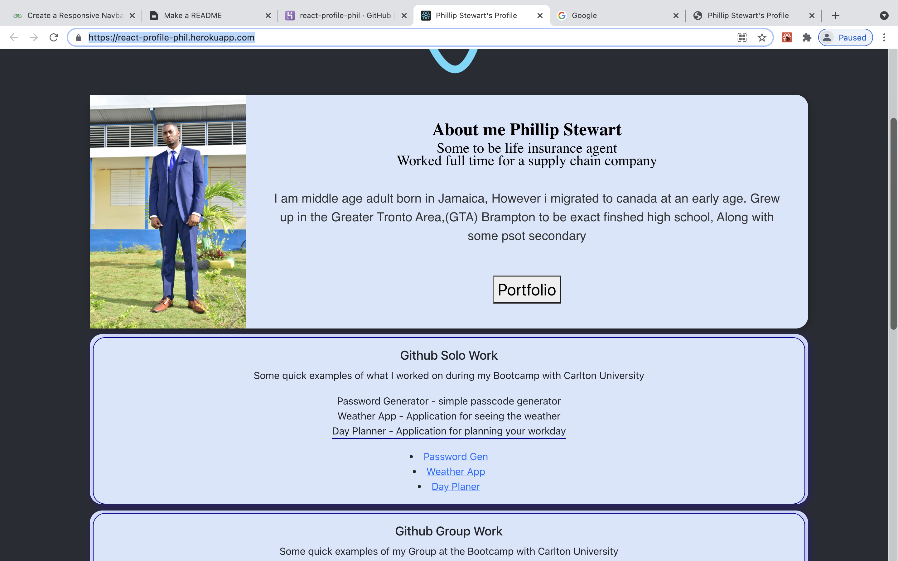
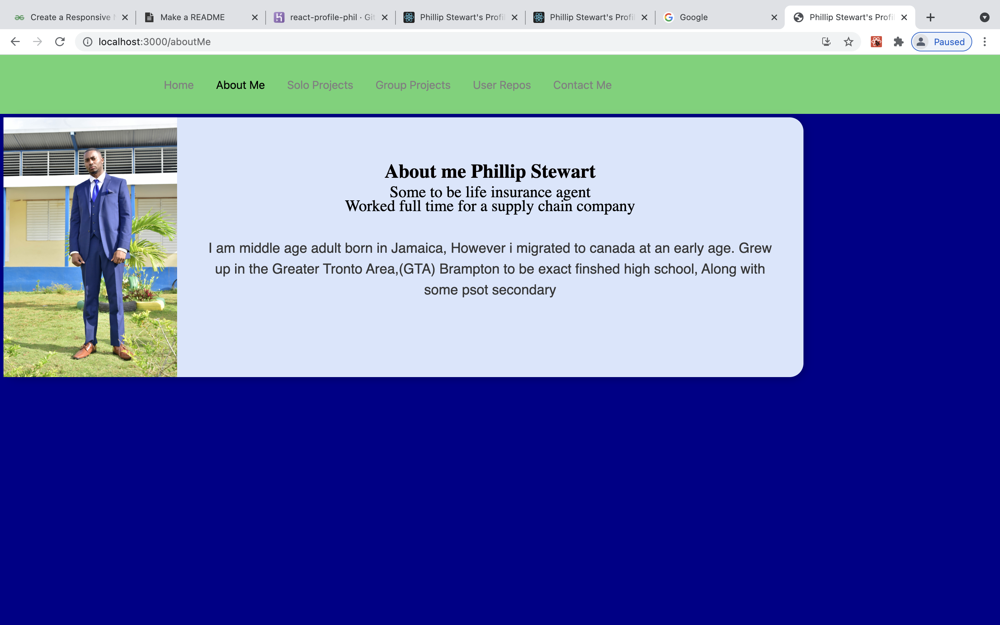

React-Profiles

Made a react profile about myself and work i have done over the bootcamp

## Installation
you can use open the link [here](https://react-profile-phil.herokuapp.com/) it will take you to heroku.
or you can clone repo and use npm i followed by npm start.

## Usage
To show an employer what we have learned over the last six month,
To show much or how little i understand coding and maybe get help fom others 
To give access to other info to get to know me.

## Challenges 

using react was long difficult road it took time to understand how to use the set up
and working with have navbar too a lot of research.

## future Development

making the page for flashing and polished i had little time left so i did what i could 

## Contributing
Pull requests are welcome. For major changes, please open an issue first to discuss what you would like to change with Phillip Stewart phil.stew@live.ca

Please make sure to update tests as appropriate.

## License
[MIT](https://choosealicense.com/licenses/mit/)

## PIC and Links

The app on [heroku](https://react-profile-phil.herokuapp.com/)
Work app on Heroku 
finally adding Navbar 

## Sorces 

Used some code of the net for the Navbar and footer bar  
found it hard to style stuff to there center.